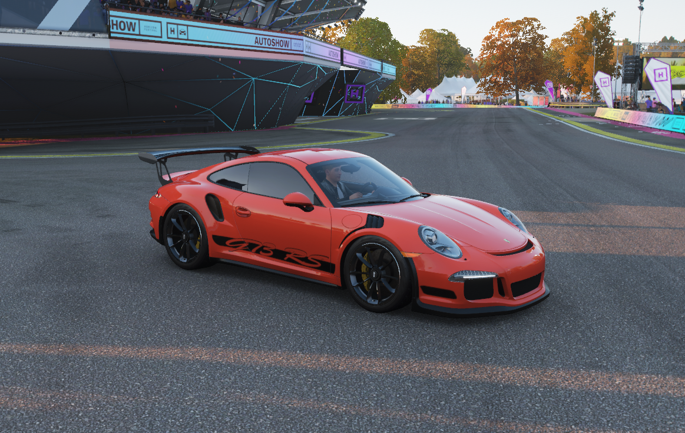

Of course, here is the complete README formatted as a single markdown file that you can copy and paste directly.

````markdown
# Forza Horizon 4 - Autonomous Driving Agent

An end-to-end self-driving pipeline for Forza Horizon 4, leveraging computer vision to interpret on-screen data and a Convolutional Neural Network (CNN) to control the vehicle in real-time. This project operates entirely on visual input, requiring no access to the game's internal memory or APIs.



---

## Table of Contents

- [Key Features](#key-features)
- [How It Works](#how-it-works)
- [Getting Started](#getting-started)
  - [Prerequisites](#prerequisites)
  - [Installation](#installation)
- [Usage](#usage)
  - [Main Menu](#main-menu)
  - [Self-Driving Demo](#self-driving-demo)
- [File Structure](#file-structure)
- [Troubleshooting](#troubleshooting)
- [License](#license)
- [Acknowledgments](#acknowledgments)

## Key Features

- **Real-time Waypoint Detection**: Extracts drivable paths directly from the in-game minimap by detecting and processing the blue route line.
- **End-to-End Deep Learning**: Utilizes a custom CNN ("Nervenet") to map raw screen pixels directly to driving commands (`[W, A, S, D]`).
- **Human Data Collection**: A robust script to record both full-screen and minimap image data along with corresponding human keyboard inputs.
- **Automated Data Balancing**: Includes an under/oversampling pipeline to prevent model bias towards common actions like driving straight.
- **Intelligent Steering Control**: Implements a custom burst-based controller to mitigate the common problem of high-frequency steering oscillation.
- **Comprehensive Tooling**: A full command-line interface to manage the entire workflow: data collection, balancing, training, testing, and performance evaluation.

## How It Works

The system operates as a four-stage pipeline, mimicking a human player's cognitive process: Perception → Decision Making → Action.

#### 1. Perception: Waypoint Extraction
The agent first identifies the target direction by processing the in-game minimap.
- The minimap region is isolated from the screen capture.
- Image is converted to grayscale and thresholded to isolate the blue navigation line.
- OpenCV's `findContours` is used to identify the line's shape.
- The center of the furthest contour is calculated and designated as the target waypoint.

#### 2. Decision Making: The "Nervenet" CNN
With the visual context, a Convolutional Neural Network decides on the appropriate driving command.
- **Input**: A 160x120 pixel frame from the main game screen.
- **Architecture**: A modified AlexNet-style CNN built with `tflearn`.
- **Output**: A 9-class one-hot encoded vector representing all possible driving inputs (e.g., `[Forward, Left, Right, Forward+Left, etc.]`).
- The model learns to associate visual cues (road curvature, car orientation) with the correct human-provided driving commands from the training data.

#### 3. Action: Burst-Based Steering
To avoid erratic, oscillating steering common in simple reinforcement learning agents, this project uses a burst-based controller.
- When a turn (`A` or `D`) is predicted, the command is held for a fixed duration (0.5 seconds).
- This creates smoother, more deliberate turning motions that are less prone to over-correction.
- The system uses the `XInput` library to emulate an Xbox controller, providing reliable inputs to the game.

#### 4. Evaluation
The model's performance is measured using standard classification metrics (Accuracy, Precision, Recall, F1-score) on a held-out test dataset, ensuring an objective assessment of its decision-making capabilities.

## Getting Started

Follow these instructions to set up and run the project on your local machine.

### Prerequisites

- **OS**: Windows 10/11
- **Game**: Forza Horizon 4 running at a supported resolution (e.g., 1024x768, windowed).
- **Python**: Version 3.8+
- **Tesseract OCR**: Required for the speedometer reading utility.
  - Download and install from [UB-Mannheim's Tesseract Wiki](https://github.com/UB-Mannheim/tesseract/wiki).
  - **Important**: Add the Tesseract installation path to your system's `PATH` environment variable.

### Installation

1.  **Clone the repository:**
    ```bash
    git clone [https://github.com/your-org/WaypointBasedSelf.git](https://github.com/your-org/WaypointBasedSelf.git)
    cd WaypointBasedSelf
    ```

2.  **Create and activate a virtual environment (recommended):**
    ```bash
    python -m venv venv
    .\venv\Scripts\activate
    ```

3.  **Install the required Python packages:**
    ```bash
    pip install -r requirements.txt
    ```

## Usage

The entire project workflow is managed through `main.py`.

### Main Menu

Launch the main command-line interface:
```bash
python main.py
````

You will be presented with the following options:

1.  **Collect Training Data**: Opens an interactive window to record gameplay.
      - Use arrow keys to align the minimap capture area.
      - Press `R` to start/pause recording.
      - Press `Q` to quit and save the data.
2.  **Balance Training Data**: Processes the collected `.npy` files to correct class imbalance.
3.  **Train Model**: Trains the Nervenet CNN on the balanced data for 50 epochs and saves the model checkpoint.
4.  **Test Model (Self-Driving Mode)**: Launches the game and runs the trained model for autonomous driving.
5.  **Waypoint Detection Only**: Runs a live visualization of the minimap waypoint detection.
6.  **Evaluate Model**: Calculates and prints performance metrics for the trained model.
7.  **Quit**: Exits the program.

### Self-Driving Demo

To run a standalone demonstration of the waypoint detection and steering:

```bash
python demo.py
```

## File Structure

```
WaypointBasedSelf/
├── main.py            # Main CLI menu for the entire workflow
├── demo.py            # Standalone demo for detection and steering
├── train_model.py     # Handles the CNN training process
├── test_model.py      # Runs the self-driving inference loop
├── draw_lanes.py      # Core logic for minimap processing and waypoint detection
├── balance_data.py    # Script for balancing the collected dataset
├── nervenet.py        # The tflearn CNN model architecture
├── direct_input.py    # Wrapper for emulating Xbox controller inputs (XInput)
├── ImageGrab.py       # Utility for efficient screen capturing
├── getkeys.py         # Utility for capturing keyboard inputs
└── ...
```

## Troubleshooting

  - **Game Window Not Found**: Ensure the Forza window title matches the `GAME_REGION` variable defined at the top of `main.py` and `demo.py`.
  - **"No saved models found"**: Verify that a trained model exists in the `model/<timestamp>/` directory and that it contains the `.meta`, `.index`, and `.data` files.
  - **Pillow/PIL Errors**: If you encounter resampling errors related to the `Pillow` library, try forcing an upgrade: `pip install --upgrade pillow`.

## License

Distributed under the MIT License. See `LICENSE.txt` for more information.

## Acknowledgments

This project was made possible by the following open-source libraries:

  - [TensorFlow](https://www.tensorflow.org/)
  - [tflearn](https://github.com/tflearn/tflearn)
  - [OpenCV](https://opencv.org/)
  - [Tesseract OCR](https://github.com/tesseract-ocr/tesseract)

<!-- end list -->

```
```
